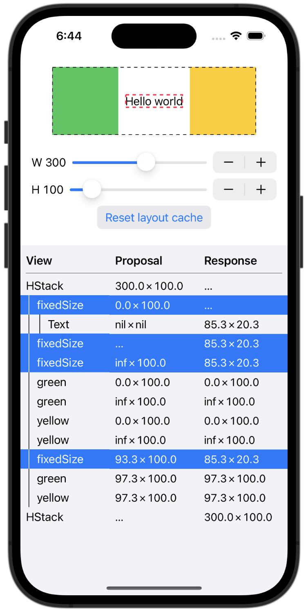

# SwiftUI Layout Inspector

<https://github.com/ole/swiftui-layout-inspector>

A Swift library (and iOS/Mac app) for learning how the SwiftUI layout system works,
and for debugging your own layout code. Inspect the layout behavior of SwiftUI
views, i.e. what sizes views propose to their children and how a view determines
its own size.

## Motivation

At its core, SwiftUI’s layout algorithm is wonderfully simple:

1.  The parent view proposes a size to its child view(s). Width and height are
    both optional; either one (or both) can be `nil`.

2.  The child view determines its own size, taking the proposed size into
    account, as well as the sizes of its own children (it’s a recursive
    process).
    
3.  The child reports its size back to the parent. The parent can’t change the
    child’s size (in SwiftUI, each view determines its own size).
    
4.  The parent view positions its children.

Complex layouts in SwiftUI can be achieved by composing built-in views and view
modifiers. The tricky part about understanding the layout system is learning the
layout behaviors of the built-in views, many of which are poorly documented (as
of November 2022). The goal of this package is to help you learn.

## Components

Layout Inspector consists of:

- The `LayoutInspector` library, provided as a SwiftPM package. Add it to your
  own SwiftUI app to debug your layout code.

- The `LayoutInspectorDemo` app, an iOS and Mac app that shows Layout Inspector
  in action.

## Requirements

iOS 16.0 or macOS 13.0 (because it requires the `Layout` protocol).

## Instructions

1.  `import LayoutInspector`

2.  At the top of the view tree you want to inspect, insert `.inspectLayout()`.
    
3.  Insert `.layoutStep("View label")` at each point in a view tree where you
    want to inspect the layout algorithm (what sizes are being proposed and
    returned). This is necessary to inject the helper "views" that observe the
    layout process.

## Acknowledgements

Idea and initial code based on: [objc.io, Swift Talk episode 318, Inspecting SwiftUI's Layout Process (2022-08-19)](https://talk.objc.io/episodes/S01E318-inspecting-swiftui-s-layout-process)

Runtime warnings in Xcode: [Point-Free, Unobtrusive runtime warnings for libraries (2022-01-03)](https://www.pointfree.co/blog/posts/70-unobtrusive-runtime-warnings-for-libraries)

See also [Credits.md](Credits.md)
